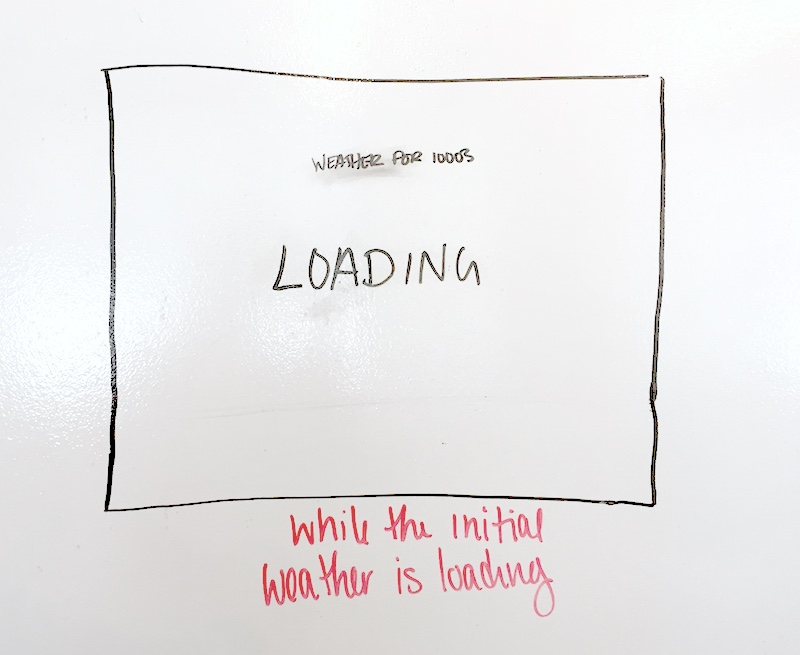
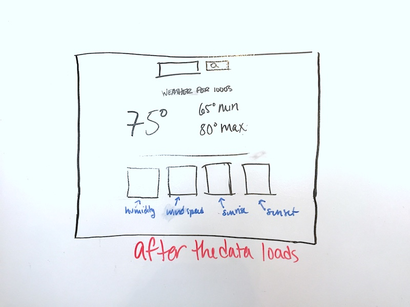
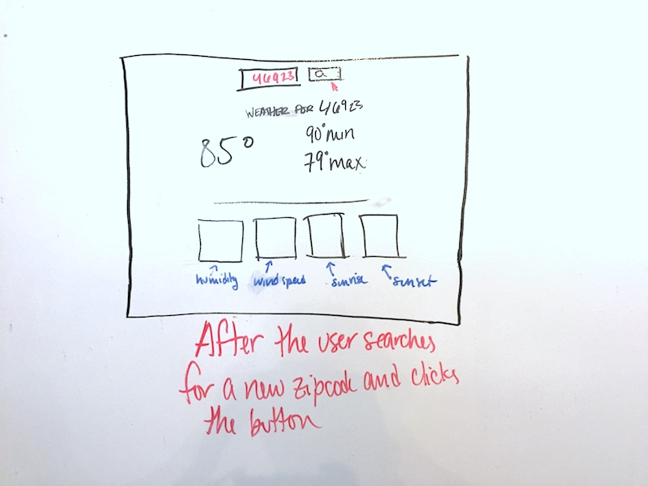

# HOMEWORK: React Weather!!

Tonight, you'll be building a weather app using React!!

You'll be using the Open Weather API that we've used before a couple of times.

## Wireframes!!

To describe these wireframes with words:

- When the page first loads, it should display a "Loading" message. This is because it will be making an API call to the Open Weather API.
    - This means that we'll need to set an initial zip code in the state for it to access.
- Once the API data comes back, it should display the weather for zip code `10003` (GA's zip code!!).
- **BONUS**: When users input a new zip code into the input box and click the submit button, another API call is made to get the new data for the zip code.
- **BONUS**: If the temp is above 80, it shows up in red; if it is below 50, it shows up in blue.

### Before you start!

- What initial values will you need to have in state?
- What components will you need to make?

## 🚀 Completion looks like:

- You have a React app in this repository.
- Your React app has multiple components and has state
- You are making your API calls using axios or fetch

## 🚀 Your homework submission should include:

- A pull request created on _this repo_.
- Completion, comfort, wins, losses, questions... you know the drill.

## This homework is due 🚨 11PM ON THURSDAY NIGHT 🚨